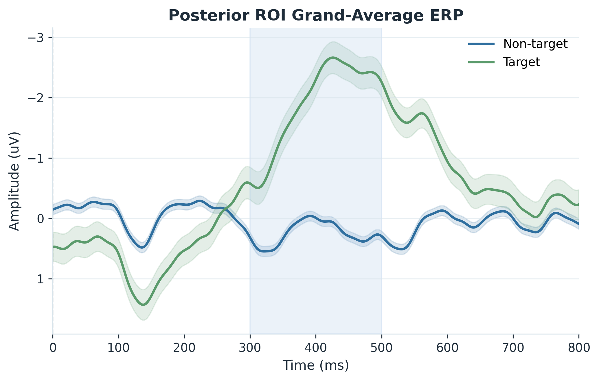
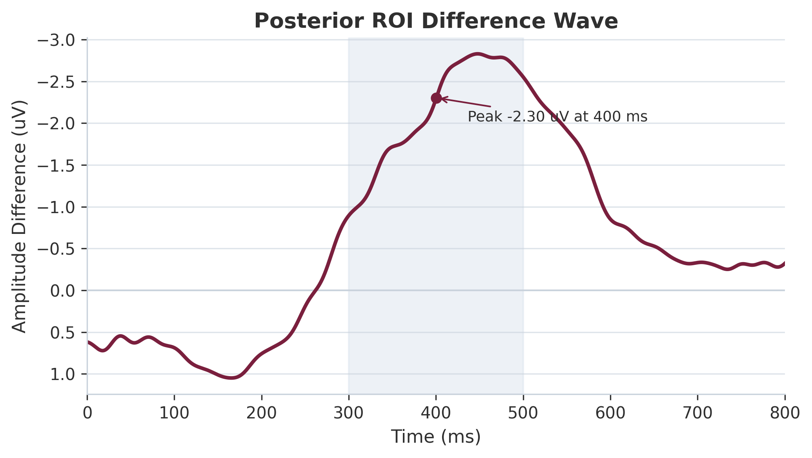
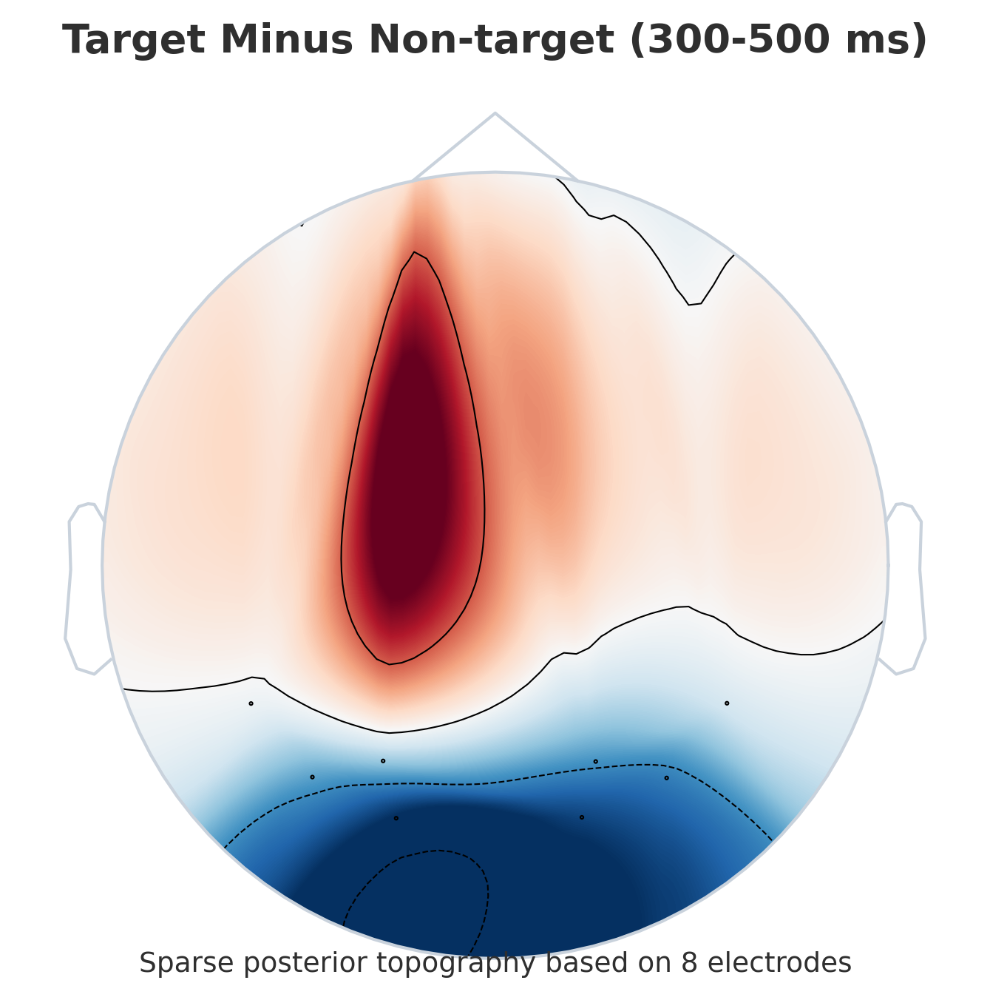
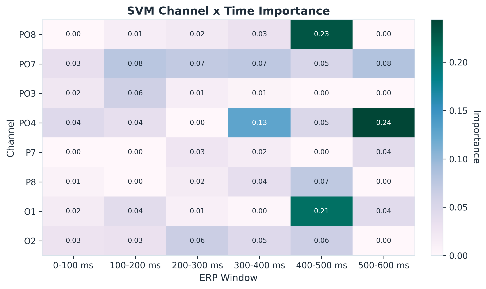
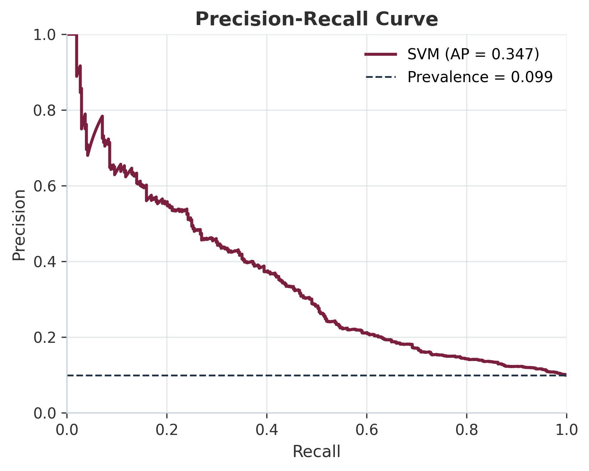

# RSVP EEG ERP Attention Detection

Lightweight, reproducible EEG/ERP pipeline for detecting target responses in rapid serial visual presentation (RSVP) data from the PhysioNet `ltrsvp` dataset.

This repository is built around a simple neuroengineering question: can sparse posterior EEG channels recover target-related ERP structure, especially in the `400-500 ms` window associated with the posterior P300 response?

<p align="center">
  
</p>

## Why This Repo

- ERP-first RSVP analysis instead of generic tabular ML storytelling
- Sparse 8-channel posterior montage: `PO8, PO7, PO3, PO4, P7, P8, O1, O2`
- Honest imbalance-aware reporting with pooled and subject-aware evaluation
- Publication-ready figures, LaTeX tables, and manuscript text already generated

## Current Result Snapshot

- Best pooled model: `SVM`
- Balanced accuracy: `0.6729`
- Recall: `0.5196`
- Precision: `0.2480`
- F1 score: `0.3357`
- PR AUC: `0.3467`
- Most informative ERP window: `400-500 ms`
- Most relevant channels: `PO4`, `PO7`, `O1`

## Visual Highlights

<p align="center">
  
  
</p>

<p align="center">
  
  
</p>

## Dataset

- Source: [PhysioNet EEG Signals from an RSVP Task](https://physionet.org/content/ltrsvp/1.0.0/)
- Local EDF files are expected in `eeg-signals-from-an-rsvp-task-1.0.0/`
- The dataset is not committed to the repository

## Reproduce

```bash
python main_pipeline.py
```

Main outputs:

- `results/results_paragraph.tex`
- `results/methods_paragraph.tex`
- `results/discussion_paragraph.tex`
- `results/latex_table_performance_main.tex`
- `results/final_replacements_for_paper.tex`

Main paper figures:

- `figures/erp_grand_average_roi.png`
- `figures/erp_difference_wave_roi.png`
- `figures/topomap_difference_300_500ms.png`
- `figures/feature_heatmap_channel_time.png`
- `figures/pr_curve_best_model.png`
- `figures/latency_breakdown.png`

## Start Here

- Full paper assembly guide: `README_results.md`
- Exact figure environments and replacement text: `results/final_replacements_for_paper.tex`
- Figure-by-figure recommendation: `results/figure_selection_guide.md`

## Takeaway

The pipeline does not overclaim high-performance BCI readiness. Instead, it provides a transparent RSVP EEG baseline showing that target-related information is detectable in sparse posterior recordings, with the strongest evidence concentrated in the `400-500 ms` interval.
