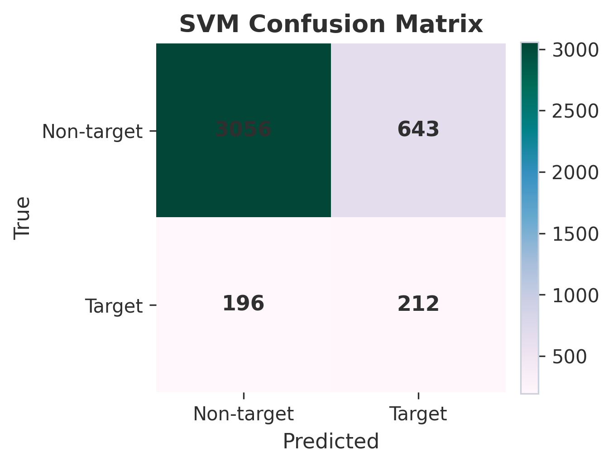
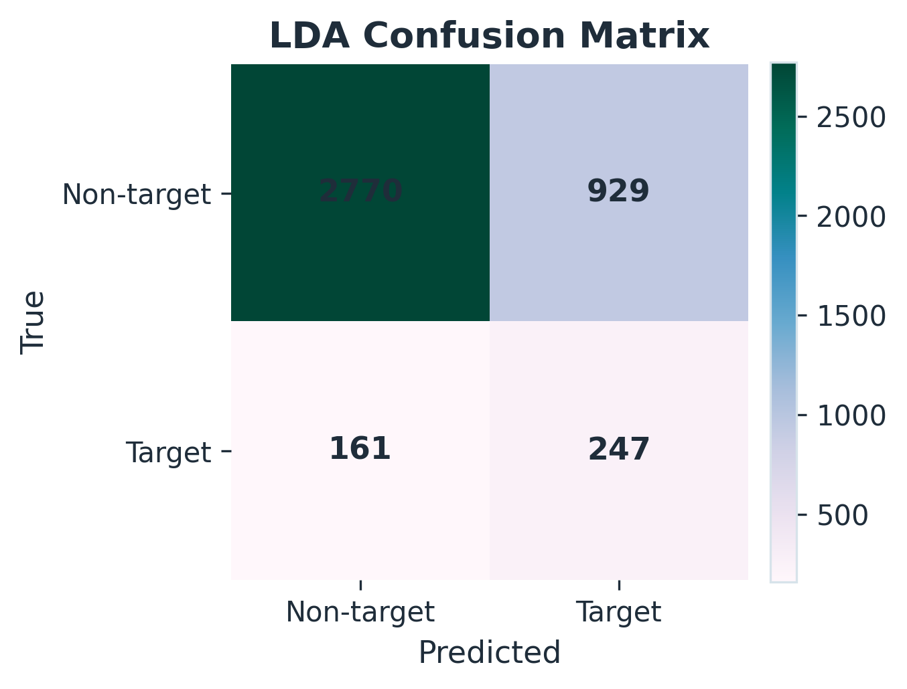
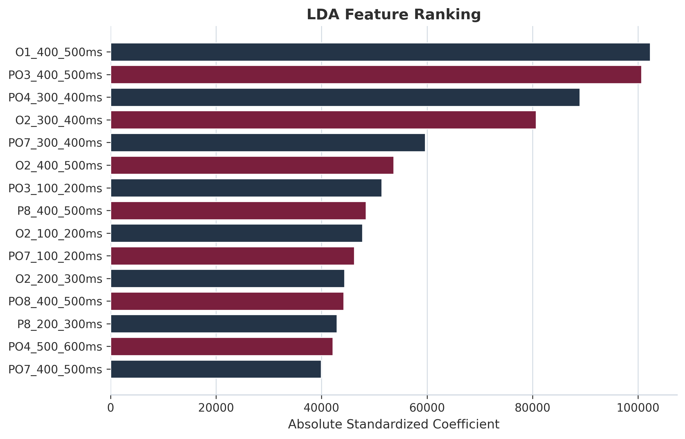
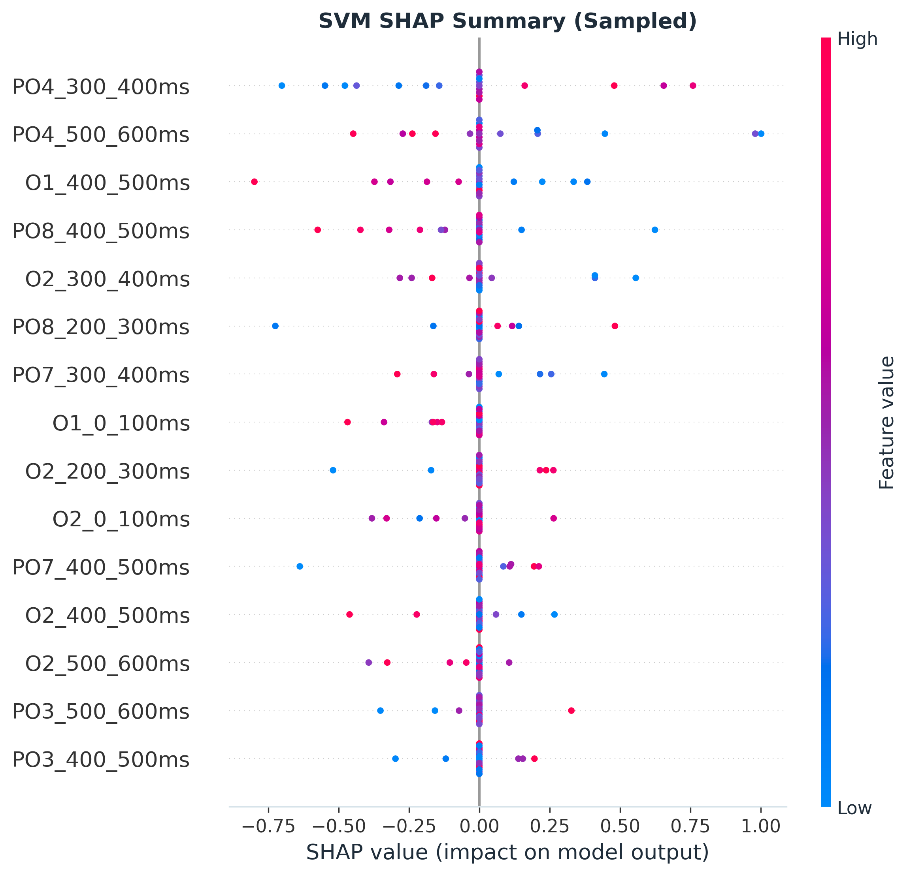
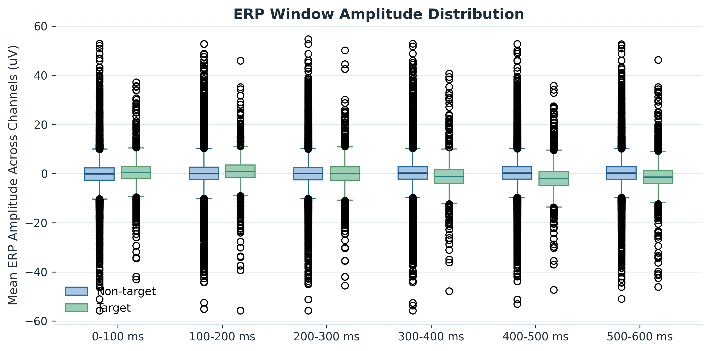
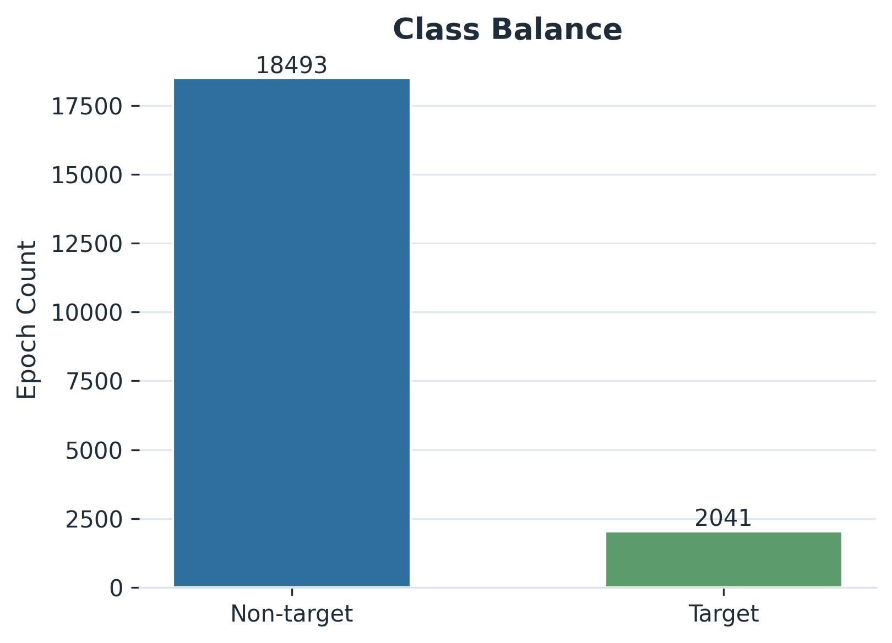

# EEG RSVP Attention Detection: Reproducible Paper Assets (ERP Features)

This project provides a clean, reproducible experimental pipeline for target vs non-target detection in RSVP EEG using ERP-based features (P300-oriented), plus publication-ready outputs (figures and LaTeX snippets).

## Dataset (PhysioNet LTRSVP)
Dataset download page:
`https://physionet.org/content/ltrsvp/1.0.0/`

This repository does not include the EDF recordings. Extract the dataset into:
`./eeg-signals-from-an-rsvp-task-1.0.0/`

## Current Results (This Repo)
Best pooled model: `SVM` (RBF, `class_weight='balanced'`)
- Accuracy: `0.7957`
- Precision: `0.2480`
- Recall: `0.5196`
- F1: `0.3357`
- ROC AUC: `0.7394`

Class balance after processing: `2041 target / 18493 non-target` epochs (roughly 9:1 imbalance).

## Why ERP Features
In RSVP datasets, target-related information is typically dominated by the P300 ERP rather than sustained spectral power differences. This implementation therefore uses windowed ERP mean-amplitude features within the epoch.

## Method Summary
- Channels: `PO8, PO7, PO3, PO4, P7, P8, O1, O2`
- Preprocessing: bandpass `0.5-40 Hz`, no ICA
- Epoching: `t = 0.0` to `0.8 s` after each stimulus, no baseline correction
- Features: mean amplitude in the following windows (ms):
  - `0-100`, `100-200`, `200-300`, `300-400`, `400-500`, `500-600`
  - Total: `8 channels x 6 windows = 48` features per epoch
- Models:
  - LDA (shrinkage + balanced priors)
  - RBF-SVM with `class_weight='balanced'`
- Evaluation:
  - Pooled stratified random split (80/20, `random_state=42`)
  - Subject-aware group split by subject ID (80/20 groups, `random_state=42`)

## How To Reproduce
1. Create an environment and install dependencies:
   - `python -m venv .venv`
   - `source .venv/bin/activate`
   - `python -m pip install -r requirements.txt`
2. Download and extract the dataset into `./eeg-signals-from-an-rsvp-task-1.0.0/`
3. Run:
   - `python main_pipeline.py`

Outputs will be regenerated under `results/`, `figures/`, and `logs/`.

## Paper-Ready Copy/Paste
- Results paragraph: `results/results_paragraph.tex`
- Methods paragraph: `results/methods_paragraph.tex`
- Performance table: `results/latex_table_performance.tex`
- Latency table: `results/latex_table_latency.tex`

## Figures (Insert Into The Paper)

## Improvement Over Prior Bandpower Pipeline
Switching from bandpower to ERP-window features improved pooled performance substantially:
- LDA: Accuracy `0.5235 -> 0.7346`, F1 `0.1676 -> 0.3119`, Recall `0.4828 -> 0.6054`
- SVM: Accuracy `0.5982 -> 0.7957`, F1 `0.1556 -> 0.3357`, Recall `0.3725 -> 0.5196`

## Files In This Repository
- `main_pipeline.py`: end-to-end runner that regenerates all outputs
- `requirements.txt`: minimal reproducible dependency list
- `results/model_metrics.csv`: metrics for pooled and subject-aware evaluation
- `results/experiment_summary.json`: manifest + mappings + aggregated info
- `figures/*.png`: publication-ready figures

## Notes / Limitations
- SHAP for RBF-SVM uses a sampled KernelExplainer configuration for runtime stability.
- Confusion matrices correspond to the pooled random split; subject-aware metrics are reported in `results/model_metrics.csv`.
